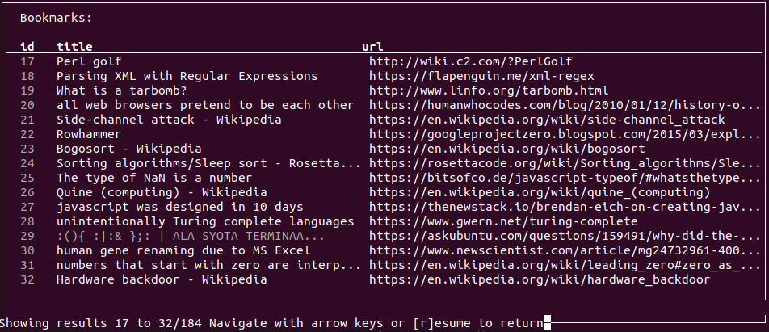

# Ohtu-miniprojekti

  

## Backlogs
- [Product Backlog](https://docs.google.com/spreadsheets/d/1UTAB7X3for7kcB7_GlngaTnpXSxTQixwS3AyCQtQa9s/edit#gid=1)
- [Sprint 1 Backlog](https://docs.google.com/spreadsheets/d/1UTAB7X3for7kcB7_GlngaTnpXSxTQixwS3AyCQtQa9s/edit#gid=0)
- [Sprint 2 Backlog](https://docs.google.com/spreadsheets/d/1UTAB7X3for7kcB7_GlngaTnpXSxTQixwS3AyCQtQa9s/edit#gid=8)
- [Sprint 3 Backlog](https://docs.google.com/spreadsheets/d/1UTAB7X3for7kcB7_GlngaTnpXSxTQixwS3AyCQtQa9s/edit#gid=9)

## Installation

Download the latest [release](https://github.com/sainigma/ohtu-miniprojekti/releases/latest) for your platform, extract it and run `./ohtu-miniprojekti`. Check release page for use instructions.

## Development

### Commands

Initialize the environment and install project dependencies with `poetry install`

Go to the virtual environment with `poetry shell`

#### From poetry shell:

`invoke start` to run the application

`invoke verify` to run unit-tests, Robot-tests and lint.

See [tasks.py](https://github.com/sainigma/ohtu-miniprojekti/blob/main/tasks.py) for all invoke tasks.

#### From shell:

`./build.sh` to build the application as a portable application. The resulting tar-ball can be found in releases/ folder.

### Definition of done

User story is tested with Robot Framework imitating end-user behaviour.

Main functionalities are manually tested.

Our CI-pipeline passes.

\>70% Code coverage for unit-tests.

Pylint as a static analysis.

Acceptance criteria met.

### Robot tests

[All robot tests](https://github.com/sainigma/ohtu-miniprojekti/tree/main/src/tests/robot)

### Coverage report

